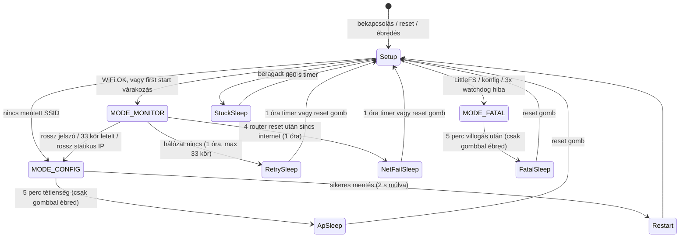
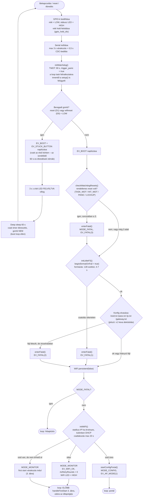
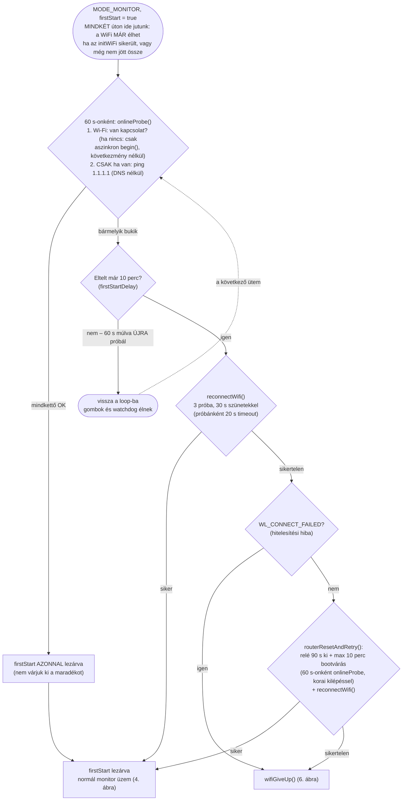
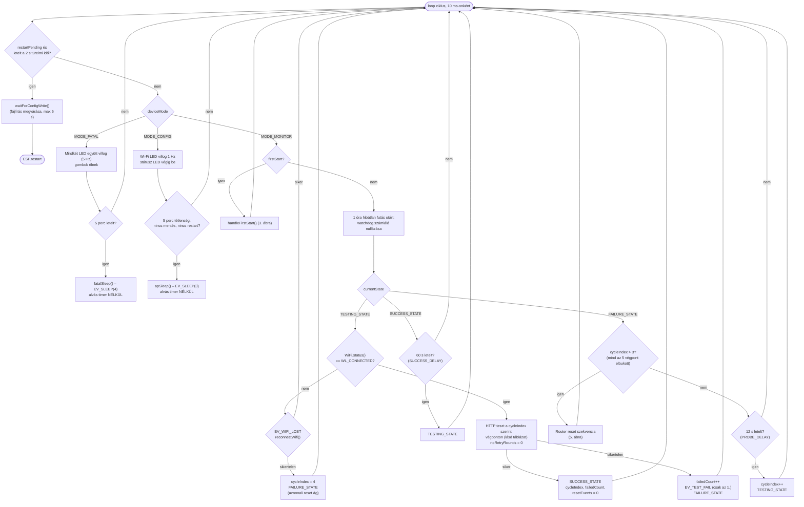
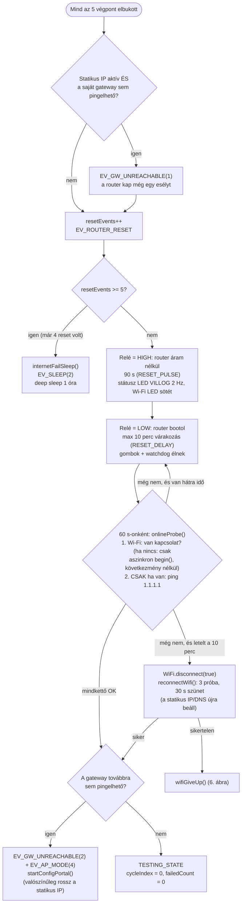
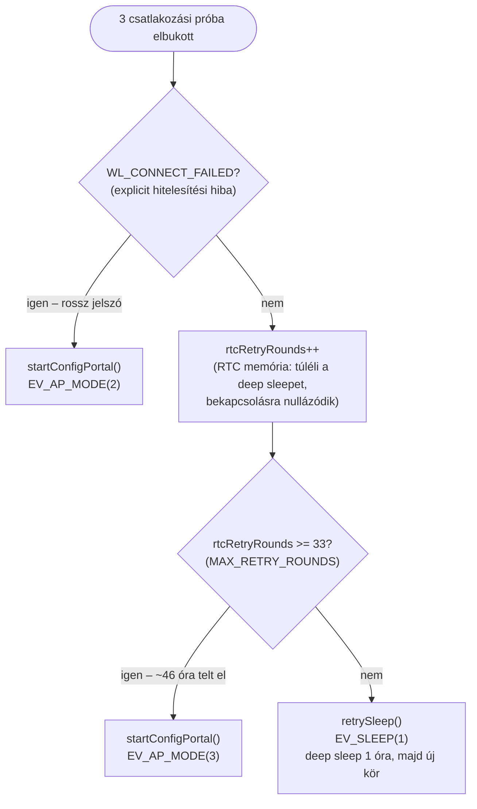
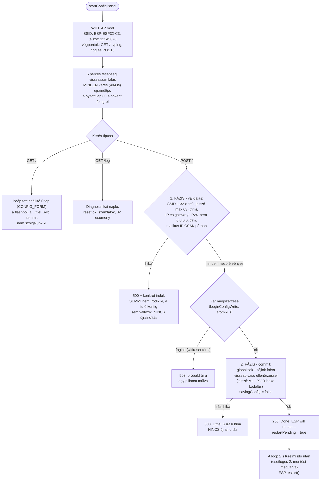
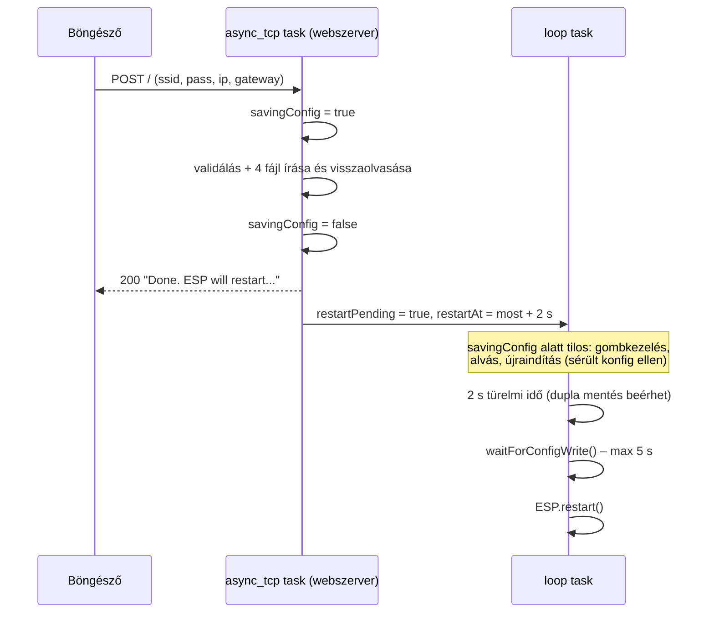
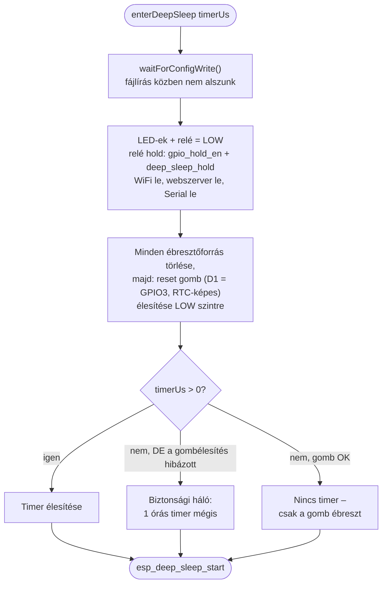

# Folyamatábrák

A firmware **jelenlegi** működésének pontos folyamatábrái, [Mermaid](https://mermaid.js.org/)
jelöléssel – a GitHub és a GitLab natívan rendereli, a forrás pedig a kóddal
együtt verziókezelhető és diff-elhető. Minden időzítés és feltétel a
`bazsi_router_reboot.ino` konstansaiból származik; a doboz-feliratok a tényleges
függvény- és konstansneveket használják, hogy az ábra a kódból ellenőrizhető
legyen.

Jelölés: lekerekített doboz = belépési/kilépési pont, rombusz = döntés,
téglalap = művelet. Az `EV_*` címkék a diagnosztikai napló eseménykódjai
(lásd `MUKODES.md` 12. fejezet).

---

## 1. Üzemmódok – madártávlat

Az eszköz minden ébredése teljes újraindulás (a deep sleep is), ezért a teljes
életciklus a `setup()`-ból indul. Négy üzemmód van; alvásból mindig a
`setup()`-ba tér vissza.

---

## 2. `setup()` – indulási folyamat

---

## 3. First start – türelmi idő induláskor

Áramszünet után a router lassabban bootol, mint az ESP; ezért mentett SSID
mellett az eszköz nem megy azonnal AP módba. A 10 perc **felső korlát**:
60 másodpercenként megnézzük, hogy visszajött-e a hálózat és az internet, és
ha mindkettő megvan, a várakozás azonnal véget ér.

---

## 4. `loop()` diszpécser és a monitor állapotgép

### Teszt végpontok (ciklikus eszkaláció)

| Kiírt sorszám | `cycleIndex` | Végpont | Elvárt válasz |
|:---:|:---:|---|---|
| 1 | 0 | `http://www.msftconnecttest.com/connecttest.txt` | `Microsoft Connect Test` |
| 2 | 1 | `http://cp.cloudflare.com/generate_204` | 204 No Content |
| 3 | 2 | `http://detectportal.firefox.com/success.txt` | `success` |
| 4 | 3 | `http://nmcheck.gnome.org/check_network_status.txt` | `NetworkManager is online` |
| 5 | 4 | `http://connectivitycheck.gstatic.com/generate_204` | 204 No Content |

A soros port és a `/log` oldal **1-től** számol, a `cycleIndex` változó viszont
0-alapú marad – ahhoz kötődik a végpontválasztó `if`-lánc és a
`RESET_TRIGGER_CYCLE` küszöb is.

Router reset csak akkor indul, ha **mind az öt** üzemeltető végpontja elbukott
– egyetlen szolgáltató kiesése így sosem látszik internetkimaradásnak.

---

## 5. Router reset szekvencia (FAILURE, `cycleIndex > 3`)

---

## 6. `wifiGiveUp()` – a 46 órás kitartási politika

Egy kör ébren töltött ideje ~25,5 perc (10 perc várakozás + 3 próba + 90 s
reset + 10 perc bootvárás + 3 próba). A két 10 perces tétel **felső korlát** –
de erre a számításra ez nem hat: ha a hálózat végig halott (márpedig ez a
szakasz pontosan arról szól), az `onlineProbe()` sosem sikerül, és a körök
teljes hosszukban futnak. A körök között 1 óra alvás:
33 × 25,5 perc + 32 × 60 perc ≈ **46 óra** türelem, mielőtt AP módba vált
(mérve: `R8` teszt).

---

## 7. AP beállító portál (MODE_CONFIG)

### A mentés két taskja (halasztott újraindítás)

---

## 8. Elalvás és ébredés

Minden alvás a közös `enterDeepSleep()`-en megy át:

| Alvás | Kiváltó ok | Napló | Timer | Reset gomb ébreszt? |
|---|---|---|:---:|:---:|
| `retrySleep()` | a hálózat nem látszik, kör < 33 | `EV_SLEEP(1)` | 1 óra | igen |
| `internetFailSleep()` | 4 router reset után sincs internet | `EV_SLEEP(2)` | 1 óra | igen |
| `apSleep()` | AP portál 5 perc tétlenség | `EV_SLEEP(3)` | – | igen |
| `fatalSleep()` | végzetes hiba, 5 perc villogás után | `EV_SLEEP(4)` | – | igen |
| beragadt gomb | reset/wifireset LOW induláskor | `EV_STUCK_BUTTON` | 60 s | **nem** (szándékosan) |

Ébredéskor az eszköz teljesen újraindul (`setup()`, 2. ábra); a RAM-beli
számlálók nullázódnak, az RTC memóriában csak a `rtcRetryRounds`, a watchdog
számláló és a diagnosztikai napló él túl.

---

*Az ábrák a `bazsi_router_reboot.ino` aktuális állapotát dokumentálják.
Módosításkor a kóddal együtt frissítendők – a viselkedést a `test/` alatti
208 forgatókönyves (678 ellenőrzéses) tesztkészlet rögzíti.*
